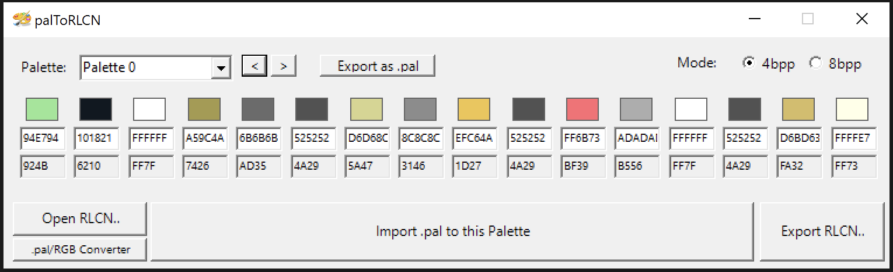

# PALtoRLCN
Import .pal files into RLCN (NCLR) files

## Features

* <b>Import 16-colors PAL files</b> to RLCN (NCLR)
* Convert 16-colors PAL to 16-colors RLCN (NCLR)
* Encode colors as BGR-555 values
* Export PAL from RLCN slot
* Simple RGB/BGR-555 converter
* Fixes issues when importing an incomplete palette <i>(real Tinke moment)</i>

## Requirements
* The latest version of .NET Famework from Microsoft

## Notes
<b>Supports only Windows/Microsoft (*.pal) palette format</b>

This tool was made primarily for Pokémon DS ROM-Hacking

Compatibility isn't ensured with all types of RLCN/NCLR that you might encounter in other DS games
